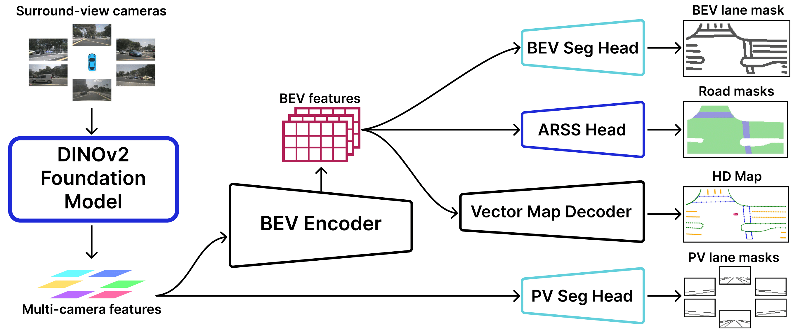

<div align="center">
<h1>MapFM</h1>
<h3>Foundation Model-Driven HD Mapping
with Multi-Task Contextual Learning</h3>


[Leonid Ivanov](https://github.com/LIvanoff)<sup>1</sup>, [Vasily Yuryev](https://github.com/vas0x59)<sup>1</sup> and [Dmitry Yudin](https://cogmodel.mipt.ru/yudin)<sup>1,2</sup>
 
<sup>1</sup> Intelligent Transport Lab, MIPT, <sup>2</sup> AIRI

ArXiv Preprint (arXiv 2506.15313)


</div>

#
### News
* **`14 July 2025`:** MapFM is accepted by HAIS 2025! 🎉
* **`8 Jun 2025`:** We released preprint on Arxiv. Code/Models are coming soon. 🚀


## Introduction

In autonomous driving, high-definition (HD) maps and semantic maps in bird's-eye view (BEV) are essential for accurate localization, planning, and decision-making. This paper introduces an enhanced End-to-End model named **MapFM** for online vectorized HD map generation. We show significantly boost feature representation quality by incorporating powerful foundation model for encoding camera images. To further enrich the model's understanding of the environment and improve prediction quality, we integrate auxiliary prediction heads for semantic segmentation in the BEV representation. This multi-task learning approach provides richer contextual supervision, leading to a more comprehensive scene representation and ultimately resulting in higher accuracy and improved quality of the predicted vectorized HD maps. We have an increase in mean average precision (mAP) compared to baseline on the nuScenes dataset.




## TODO

- [ ] Release the code.

- [ ] Release pre-trained models.


## Acknowledgements

MapFM is based on [mmdetection3d](https://github.com/open-mmlab/mmdetection3d). It is also greatly inspired by the following outstanding contributions to the open-source community: [MapQR](https://github.com/HXMap/MapQR), [Cross View Transformers](https://github.com/bradyz/cross_view_transformers), [Hugging Face](https://github.com/huggingface/transformers).


## Citation

If the paper and code help your research, please kindly cite:

```BibTeX
@article{ivanov2025mapfm,
  title={MapFM: Foundation Model-Driven HD Mapping with Multi-Task Contextual Learning},
  author={Ivanov, Leonid and Yuryev, Vasily and Yudin, Dmitry},
  journal={arXiv preprint arXiv:2506.15313},
  year={2025}
}
```